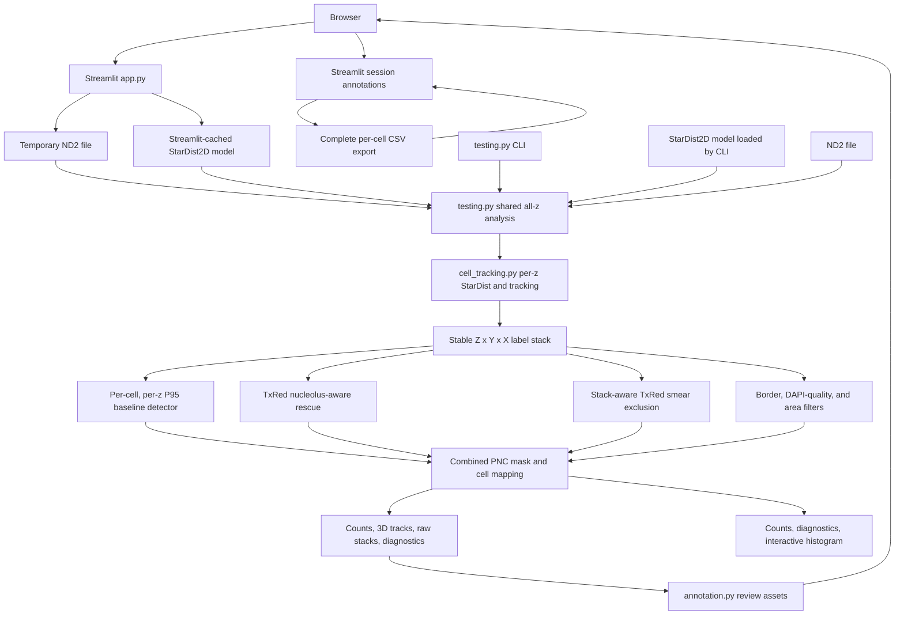

# PNC Cell Analysis

This repository contains a Streamlit analysis and ground-truth annotation
website plus a command-line pipeline for detecting PNC candidates in ND2
fluorescence microscopy images, mapping those detections to segmented nuclei,
and reporting how many cells have at least one PNC.

The code uses the word `cell` for each StarDist-segmented DAPI object. In the
current images, that object is the nucleus used as the cell-level counting unit.
A cell is counted once even when it contains multiple PNC components or a PNC is
visible in more than one z-layer.

## Current integration status

The website and command-line interface now share the all-z detector in
`testing.py`:

| Path | Entry point | Analysis backend | Status |
|---|---|---|---|
| Streamlit website | `streamlit run app.py` | `testing.py` | All-z analysis, cell review, annotation import/export, and diagnostics |
| Command-line interface | `python testing.py image.nd2` | `testing.py` | All-z analysis and interactive Matplotlib diagnostics |
| Legacy backend | — | `pnc_analysis.py` | Retained first-z implementation; no longer imported by the website |

Both active entry points therefore use the same P95 baseline, TxRed
nucleolus-aware rescue, smear exclusion, and cell-quality filters. The website
adds a review surface without prediction colors so ground truth can be recorded
without treating the algorithm output as truth. Its default image presentation
follows the supplied ND2 channel metadata and Fiji/Bio-Formats display
conventions.

## Repository layout

| File | Responsibility |
|---|---|
| `app.py` | Streamlit user interface, upload lifecycle, in-session review state, z-layer inspection, CSV import/export, and diagnostics |
| `annotation.py` | Neutral cell-selector rendering, crop rendering, cell geometry, annotation validation, and CSV serialization |
| `cell_tracking.py` | Per-layer StarDist segmentation, adjacent-z association, gap interpolation, merge partitioning, canonical labels, and segmentation fingerprints |
| `live_z_slider.py` and `components/live_z_slider/` | Browser-local z-layer scrubbing, PNG transport, stable slider state, and Fiji-like pixel rendering |
| `testing.py` | Shared all-z analysis pipeline and CLI, including nucleolus rescue and smear exclusion |
| `pnc_analysis.py` | Legacy first-z analysis backend, retained for reference |
| `test_annotation.py` | Unit tests for geometry, click mapping, crop alignment, and CSV round trips |
| `test_cell_tracking.py` | Synthetic tests for motion, dropout, artifacts, temporary/persistent merges, deterministic IDs, and z-specific PNC ownership |
| `test_live_z_slider.py` | Unit tests for z-stack validation, layer encoding, and safe initial values |
| `requirements.txt` | Python runtime dependencies |

## Architecture



### Website request lifecycle

1. Streamlit starts and caches the pretrained StarDist
   `2D_versatile_fluo` model with `st.cache_resource`.
2. The user selects a PNC threshold multiplier and uploads an ND2 file. The
   application calculates a SHA-256 fingerprint so annotations cannot be
   silently imported into a different image.
3. The upload is written to a local temporary `.nd2` file because the ND2
   reader expects a filesystem path.
4. `testing.analyze_pnc` runs StarDist independently on each DAPI layer at
   scale `0.15`, tracks the instances through z, evaluates TxRed with the mask
   from the same layer, applies quality and smear exclusions, and returns both
   algorithm results and review data. The DAPI maximum projection is retained
   only as the selection overview and for version-1 CSV reconciliation.
5. The result is retained in Streamlit session state. Annotation-widget reruns
   therefore do not repeat StarDist segmentation or PNC detection.
6. The user clicks a neutral numbered cell, reviews aligned DAPI and raw TxRed
   crops at each z-layer, and records PNC, smear, and segmentation ground truth.
7. A schema-2 CSV download writes one row for every track, including unreviewed
   cells. Direct restore requires both the exact image SHA-256 and exact
   label-stack fingerprint. Version-1 CSVs use conservative geometry/IoU
   migration and report every row that still needs manual reconciliation.
8. The temporary ND2 file is removed in a `finally` block, including when
   analysis fails.

The website has no database or authentication layer. Uploaded image data is
processed locally and the temporary ND2 copy is deleted after analysis.
Annotations persist only in the current Streamlit session, so the CSV must be
downloaded regularly. The pretrained StarDist model may be downloaded from its
upstream source the first time it is used and then cached by the model library.

## Input assumptions

Both analysis paths currently index ND2 data with axes in this order:

```text
Z, C, Y, X
```

Default channel assignments are:

| Index | Expected signal | Use |
|---|---|---|
| `0` | DAPI | Cell/nucleus segmentation |
| `1` | TxRed | Baseline PNC detection and nucleolus-aware rescue |
| `2` | Cy5 | Present in the validation image but unused by the algorithm |

Channel indices can be overridden from the command-line interface. The code does not
currently infer channel identity from ND2 channel names.

The validation ND2 used while developing the nucleolus feature has shape
`(8, 3, 2044, 2048)`: eight z-layers, three channels, and 2044 by 2048 pixels.
The smear-development files contain between six and eleven z-layers, with the
same channels and image dimensions. Other ND2 axis layouts require adaptation
before indexing the arrays.

## Website annotation methodology

The annotation interface deliberately separates human ground truth from the
algorithm prediction.

### 1. Select a cell without prediction colors

`annotation.make_selector_assets` converts the DAPI maximum projection into a
numbered overview with white segmentation boundaries. The default Fiji-style
view uses the blue DAPI lookup-table color stored in the ND2 metadata; the
optional high-contrast view uses grayscale. Clicking the image returns
display-space coordinates, which are mapped through a nearest-neighbor-resized
label image. A small eight-pixel tolerance allows clicks just outside an
outline without selecting a distant cell. A cell-ID dropdown provides a
keyboard-accessible fallback.

Only the selected cell receives a yellow outline. Baseline-positive,
nucleolus-rescued, smear-positive, and excluded cells are not color-coded on
this review image. Algorithm calls are hidden by default but can be revealed
from the sidebar.

### 2. Inspect aligned raw data

For the selected cell, the website shows:

- the raw DAPI crop from the current layer with a blue Fiji LUT;
- the raw TxRed crop from that same layer with a red Fiji LUT;
- the selected track's current-layer boundary in yellow on both images;
- observed and interpolated layers, median cross-sectional area, and automatic
  segmentation-quality status; and
- the original-image centroid and crop coordinates.

The default **Fiji-style image display** sidebar setting follows the supplied
ND2 metadata: DAPI is blue and TxRed is red. It also follows Bio-Formats
Autoscale semantics by linearly mapping the full stack's raw minimum and
maximum to the 8-bit display range. DAPI and TxRed limits come from their
complete raw z-stacks, so
zooming to another cell or moving between z-layers does not silently change
brightness. Values are mapped for display as:

```text
display = round(255 * clip((raw - raw_min) / (raw_max - raw_min), 0, 1))
```

Turning Fiji-style display off restores the earlier crop-optimized view: DAPI
is grayscale, TxRed is magenta, and percentile limits increase contrast within
the selected crop. Both modes are display-only. Segmentation, PNC detection,
nucleolus rescue, smear detection, CSV values, and counts continue to use the
unchanged raw arrays.

One browser-local slider changes DAPI, TxRed, and both yellow boundaries while
its handle is still being dragged. The browser uses nearest-neighbor-style
pixel rendering for both crops. Layer scrubbing and its current position stay
inside the component, so dragging does not rerun the Streamlit page or change
its scroll position. The initial layer is the layer containing that track's
brightest raw TxRed pixel, but this is only a navigation convenience and not a
ground-truth label.

### 3. Record independent labels

Every segmented label can receive:

- PNC ground truth: `positive`, `negative`, `ambiguous`, or `unreviewed`;
- one or more one-based PNC z-layers;
- smear ground truth and optional smear z-layers using the same four states;
- segmentation ground truth: `valid`, `merged_cells`, `split_cell`,
  `artifact`, `border_or_non_intact`, `ambiguous`, or `unreviewed`; and
- free-text notes.

A cell counts as fully reviewed only when PNC, smear, and segmentation fields
are all no longer `unreviewed`. Ambiguous labels remain explicit and should be
excluded from binary threshold tuning rather than silently treated as
negative. Recorded PNC layers are positive evidence only: an unlisted layer in
a positive cell is not interpreted as negative. Positive PNC or smear calls
without a z-layer are saved, but the UI warns that they should be revisited.

### 4. Export and resume safely

The CSV contains every segmented cell, not only corrections or positive cells.
Each row includes:

- image name and SHA-256 fingerprint;
- deterministic track ID, canonical centroid/bounding box, and overview area;
- segmentation version and scale, label-stack fingerprint, observed and
  interpolated z-layers, median cross-sectional area, and migration provenance;
- total z-layer count, PNC threshold settings, nucleolus rescue settings, and
  smear-exclusion state;
- algorithm PNC call and source, smear call, and exclusion status;
- human PNC, smear, segmentation, z-layer, and note fields; and
- the UTC time at which the human annotation was last saved.

Schema-2 import restores IDs only when the uploaded image fingerprint and
segmentation fingerprint both match. For a schema-1 CSV, the website
regenerates the recorded scale-`0.1` projection labels, verifies the saved
geometry, and calculates Hungarian IoU matches to current tracks. Only old
cells marked `valid` with IoU at least `0.65`, no competing overlap at least
`0.25`, and a unique one-to-one assignment transfer PNC/smear evidence and
notes. Their segmentation truth resets to `unreviewed`. Every other old row is
left entirely unreviewed and listed for manual reconciliation.

## Shared all-z methodology

`testing.py` contains the pipeline used by both the website and command-line
interface.

### 1. Z-aware cell tracks (`z_track_v1`)

StarDist runs independently on every raw DAPI layer at scale `0.15`. Adjacent
instances are linked with Hungarian assignment. A candidate association must
have area ratio `0.4–2.5` and centroid displacement no greater than `0.75`
times the sum of the two equivalent nuclear radii. Eligible costs are:

```text
0.65 × normalized centroid distance + 0.35 × (1 - mask IoU)
```

A track may bridge one missing layer but must contain detections on at least
two adjacent layers; isolated one-layer tracks are discarded as artifacts.
The missing cross-section is translated to an interpolated centroid. When one
StarDist instance temporarily contains multiple established tracks, its pixels
are partitioned by nearest predicted center, with exact ties going to the
lower deterministic track ID. The same nearest-center rule resolves overlap
between interpolated masks. A many-to-one association that persists unresolved
through the end of a track is excluded rather than presented as a confident
split.

Final IDs are assigned in row-major order of each track's median `(y, x)`
centroid. The tracker emits:

- a stable, non-overlapping `Z × Y × X` label stack for analysis;
- a non-overlapping canonical 2D label image for overview selection, using the
  most frequent positive track per pixel and nearest-center tie breaking;
- observed/interpolated layers, median cross-sectional area, centroid path,
  merge layers, and quality status per track; and
- a SHA-256 label-stack fingerprint over version, scale, shape, dtype, and
  label bytes.

The historical maximum-projection masks remain available with
`--segmentation-mode projection_v1`. They are no longer the default.

### 2. Cell eligibility filters

Border/non-intact cells are excluded with the ellipse method on tracked
cross-sections. The remaining tracks are excluded as likely segmentation
ghosts when the median of their observed-layer DAPI medians is below `0.5`
times the field median. This removes exceptionally dim objects without a fixed
camera-intensity cutoff.

The remaining cells are also excluded when their median per-layer area is:

- below `0.5 ×` the median intact-cell area; or
- above `2.0 ×` the median intact-cell area.

Filtering occurs before PNC detection, so excluded cells cannot become
PNC-positive. Using cross-sectional medians prevents ordinary z-motion from
inflating area through a projection union. Tracks above `2×` are also marked as
suspected persistent merges.

### 3. TxRed smear exclusion

The shared pipeline also excludes broken cells that overlap or touch a
broad, possibly streaky TxRed smear. It uses two complementary temporal modes.

The endpoint-growing mode detects material that becomes strongest at the top
of the z-stack:

1. Smooth the last TxRed layer and require its P99.9/P95 ratio to be at least
   `2.0`. This field-level gate prevents relative percentiles from inventing a
   smear in a field without a sufficiently strong bright tail.
2. Take the maximum of the final two TxRed z-layers.
3. Subtract the per-pixel median of the earlier TxRed layers. This emphasizes
   material that appears near the top of the stack while suppressing ordinary
   signal that persists through z.
4. Smooth the response with a Gaussian sigma of three pixels.
5. Grow candidate components above the extracellular response P98, but retain
   only components containing at least three extracellular P99.5 seed pixels.
6. Require a component area of at least 5% of the median segmented-cell area.
7. Reject a broad component unless its P95 rises by at least `1.5×` from the
   first to final z-layer and its mean intensity has at least `0.8` Pearson
   correlation with z. This filters ordinary TxRed focus changes.
8. Map a retained broad component to cells using the contact rule below.

The interior-transient mode searches every z-layer except the two endpoints:

1. Subtract the per-pixel median across the complete TxRed stack from the
   current layer, then smooth with the same three-pixel Gaussian.
2. Grow components above extracellular P98 and require extracellular P99.5
   seeds, exactly as in the endpoint mode.
3. Require connected bright support covering at least 5% of the median cell
   area. This support may be a hollow or filamentous network; no solidity or
   hole-filling requirement is applied.
4. Require the component's mean intensity to peak in the layer that produced
   it and to be at least `1.10×` the stronger of its two adjacent z-layers.
   This detects a transient interior-plane event while rejecting gradual focus
   changes.
5. Require eccentricity of at least `0.80`. The transient branch is intended
   for elongated mid-stack streaks; compact focus-dependent blobs are left
   unclassified rather than being called smears.

Both broad modes map a component to a cell when it overlaps at least 1% of the
cell area or contacts at least 2% of the cell boundary after one-pixel dilation.
Endpoint pixels are attributed to the final-two source layer that supplied
their maximum and are tested against that layer's tracked cell mask. Interior
transient components are tested only against the label mask from their exact
detection layer. Detection thresholds are unchanged.

A narrow secondary path handles subtle internal smear streaks that are too
small for the broad-component cutoff. It runs only when the same field already
contains a validated broad smear. A weak component must occupy between 1% and
5% of the median cell area, have eccentricity at least `0.75`, have mean
intensity/z correlation at least `0.95`, overlap at least 0.5% of one cell, and
remain at least one pixel inside that cell's boundary. This is intentionally
different from the PNC detector: compact bright dots are not sufficient for a
weak smear call.

The thresholds are relative to pixels outside StarDist cell labels, so they
adapt to each field's TxRed intensity. The detected smear mask remains patchy;
it is never filled into a solid object. Smear filtering runs before the
small/large cell-area filter and before PNC detection. A smear-positive cell ID
is still reported when that cell was already excluded as non-intact, while the
separate `smear_excluded_cell_ids` result records cells removed specifically by
the smear filter. Disable smear detection with `--no-smear-exclusion` for an
ablation comparison.

### 4. Baseline PNC detection

PNCs are detected independently in every original TxRed z-layer. For each cell
and z-layer:

1. Calculate the cell's 95th-percentile TxRed intensity (`P95`).
2. Apply the baseline threshold `P95 × 1.25`.
3. Label connected pixels above that threshold.
4. Retain components at least `1/1000` of the cell area.

Here, "cell" means the tracked mask on that exact z-layer. A dot in a temporary
merge or overlap belongs to the nearest tracked nucleus selected by the label
stack, so it cannot be claimed merely because it entered another cell's static
projection frame.

An optional additive mode uses `P95 + offset` instead. Supplying
`--pnc-threshold-offset` overrides baseline multiplication.

The per-z masks are combined into a 2D projected mask for diagnostics. A track
is counted once when any z-layer contains a qualifying component.

The high percentile is used because cells contain both dim and bright non-PNC
pixel populations. A right-hand histogram peak is not necessarily a PNC, and
the two non-PNC populations may overlap too much for reliable explicit
two-peak fitting.

## TxRed nucleolus-aware rescue

The rescue feature addresses small PNCs that are locally bright near a dim
nucleolus but do not pass the cell-wide baseline threshold. It runs only on
cells that are negative after baseline detection. Existing baseline-positive
classifications are therefore preserved.

### Design principle

Nucleoli and PNCs occupy different spatial scales in TxRed:

- a nucleolus is a broad, dim, approximately elliptical region; and
- a PNC is a small, locally bright component near the nucleolus boundary.

The algorithm detects the broad structure on smoothed data, but evaluates the
PNC on the original raw TxRed pixels. This prevents smoothing from erasing the
small PNC or allowing the bright PNC to define the nucleolus itself.

### 1. Build a local-darkness image

For each baseline-negative cell and each TxRed z-layer, masked normalized
Gaussian filtering calculates:

```text
nucleolus-scale image = Gaussian(cell TxRed, sigma=3)
local background      = Gaussian(cell TxRed, sigma=30)
local darkness        = local background - nucleolus-scale image
```

Normalization by a blurred cell mask prevents pixels outside the cell from
being treated as zero during smoothing. The mask is the track cross-section
from that same z-layer, not the canonical overview or a projection footprint.

### 2. Detect candidate nucleoli

Candidate darkness peaks must be inside the cell and above the 65th percentile
of the cell-interior darkness response. Each peak grows through pixels whose
darkness is at least 20% of that peak, within a radius limited relative to cell
size.

Grown regions are retained when they satisfy the default morphology limits:

| Constraint | Default |
|---|---:|
| Nucleolus area | `0.2%` to `12%` of cell area |
| Minimum solidity | `0.65` |
| Maximum eccentricity | `0.96` |
| Minimum search radius | `18` pixels |
| Maximum search radius | `0.45 ×` equivalent cell radius |

Growth is restricted to an inset cell interior, normally six to eight pixels
from the StarDist boundary. A region may touch that inset boundary but cannot
grow through the actual label edge. This tolerates modest clipping where cells
are close while retaining a protected edge margin. The convex hull of each
accepted region is then dilated by three pixels. The convex hull is important
because a bright PNC can cut a notch or hole into an otherwise dark, elliptical
nucleolus mask.

### 3. Propagate nucleolus geometry across z

For a PNC layer, nucleolus masks from that layer and one neighboring layer in
each direction are combined. This allows a nucleolus that is clearest on z8,
for example, to guide PNC detection on z7. Propagated geometry is clipped back
to the tracked mask on the PNC layer.

### 4. Apply spatially varying thresholds

The rescue detector uses the same per-cell, per-layer P95 reference as the
baseline detector but changes the multiplier by location:

| Region | Threshold |
|---|---:|
| Inside a detected nucleolus | `P95 × 0.85` |
| Outside but within 25 Euclidean pixels of its border | `P95 × 1.05` |
| All other pixels | No rescue search; baseline result is retained |

The larger reduction inside the nucleolus compensates for the dim nucleolar
background. The smaller exterior reduction is sufficient to grow border PNCs
to the existing area cutoff without lowering the threshold throughout the
cell.

The additive baseline mode does not replace these rescue multipliers. Disable
the rescue with `--no-nucleolus-rescue` when evaluating an additive-only rule.

### 5. Reject bright texture and noise

Lower raw thresholds alone would admit heterogeneous cell texture. Every rescue
component must also be a strong local bright spot.

The local-contrast response is:

```text
local contrast = Gaussian(TxRed, sigma=1.2) - Gaussian(TxRed, sigma=8)
```

The peak response in a rescue component must be at least twice the cell's
99.5th-percentile local-contrast response. A single noisy peak is not enough:
pixels meeting that local-contrast requirement must form coherent support of
at least `1/5000` of the cell area. Rescue components must also be:

- at least `1/1000` of cell area; and
- no larger than `1%` of cell area.

These checks distinguish a compact PNC from ordinary noisy bright regions or a
large intensity gradient. The core-support check reuses the already-computed
local-contrast image and therefore adds no extra Gaussian filtering.

### 6. Combine and report

Accepted rescue components are combined with baseline PNC components. Rescued
cells and rescue pixels appear yellow in the diagnostic figure; baseline
positive cells remain green. The result dictionary exposes:

- baseline, rescued, and final positive cell IDs;
- combined and baseline PNC label masks;
- projected nucleolus and exterior-band masks;
- each rescue detection's cell, z-layer, position, area, zone, and local
  contrast, plus observed and required high-contrast core support;
- low-DAPI segmentation-artifact IDs and their per-cell median DAPI values; and
- the threshold values shown in the interactive histogram.

## Development validation fixture

The following historical result used the former scale-`0.1` projection labels.
Its IDs are retained only as migration provenance and must not be compared
directly with `z_track_v1` IDs. Using `P95 × 1.25` and a `1/1000` minimum PNC
area, that legacy run produced:

| Classification source | Cell IDs |
|---|---|
| Baseline positive | `3, 4, 5, 6, 7, 10, 13` |
| Added by nucleolus rescue | `2, 8, 9, 11, 14` |
| Remained negative | `1, 12` |
| Final | `12/14` valid cells (`85.7%`) |

The requested ground-truth layers were recovered:

| Cell | Required evidence |
|---:|---|
| 2 | Interior PNC on z5 |
| 8 | Slightly interior PNC on z5 |
| 9 | Border PNC on z8 |
| 11 | Border PNC on z3 |
| 14 | PNC on z7 using nucleolus geometry visible on z8 |

The detector also generated rescue components on additional layers within some
of those already-positive cells. That does not change cell-level counting, but
those layers should be reviewed if per-layer precision becomes an objective.

This fixture is a regression target, not evidence of general accuracy. Cell IDs
depend on StarDist output and scale, and accuracy across experiments requires
ground-truth labels from multiple positive and negative images.

## Expanded manual review set

Two additional folders were reviewed at scale `0.1` against the legacy
projection IDs. Ambiguous calls are recorded but are not used to choose a
threshold. Schema-2 imports reconcile these IDs conservatively rather than
assuming they survived the segmentation upgrade.

The reviewed exceptions in the DMSO folder were:

- `2.nd2`: every rescue shown by the prior algorithm (cells 23, 29, 32, and
  38) was false;
- `4.nd2`: baseline-positive cell 11 was false, rescue cell 5 was ambiguous,
  and rescue cell 12 was correct; and
- `5.nd2`: the smear call on cell 14 was false and rescue cell 17 was
  ambiguous. Files `1.nd2` and `3.nd2` were otherwise accepted as shown.

The reviewed exceptions in the UNC12793A folder were:

- `1.nd2`: missed positives at cell 6 on z3 and cell 13 on z2;
- `3.nd2`: cell 4 was ambiguous, while labels 14 and 15 were low-DAPI
  segmentation ghosts rather than cells;
- `4.nd2`: missed positive cell 4 on z8;
- `6.nd2`: cell 16 was an ambiguous smear call; and
- `8.nd2`: rescue cell 5 was false, while cells 4 on z3 and 9 on z4/z5 were
  missed positives. Files `5.nd2` and `7.nd2` were accepted as shown.

With the current conservative changes:

- the coherent-core rule removes prior false rescues 23, 29, and 38 from DMSO
  `2.nd2`; prior false cell 32 remains, and new rescue cells 2 and 34 require
  review before they can be scored;
- UNC `1.nd2` cell 6 and UNC `4.nd2` cell 4 are recovered;
- UNC `3.nd2` labels 14 and 15 are excluded by the field-relative DAPI filter;
- UNC `8.nd2` false cell 5 is removed and true cell 4 is recovered; cell 9 is
  still missed and new rescue cell 8 requires review;
- DMSO `5.nd2` cell 14 is no longer smear-positive; and
- DMSO `4.nd2` baseline cell 11 and UNC `1.nd2` cell 13 remain unresolved.

This comparison intentionally reports new, unlabeled calls instead of assuming
they are correct or incorrect. Complete yes/no labels for every segmented cell
will be needed for an unbiased validation split.

## `z_track_v1` upgrade checks

Synthetic tests cover moving ellipses, close neighbors, a one-layer dropout,
single-layer artifacts, temporary and unresolved merges, deterministic IDs,
nearest-track overlap partitioning, and z-specific PNC ownership. On DMSO
`2.nd2`, per-layer StarDist plus tracking completed in `4.09` seconds after
model loading on the development machine, within the five-second added-work
target.

The five supplied schema-1 DMSO CSVs were dry-run through conservative
migration:

| DMSO file | New tracks | Migrated rows | Manual reconciliation rows |
|---:|---:|---:|---:|
| `1.nd2` | 28 | 20 | 8 |
| `2.nd2` | 47 | 29 | 11 |
| `3.nd2` | 21 | 14 | 6 |
| `4.nd2` | 25 | 22 | 2 |
| `5.nd2` | 21 | 16 | 1 |

DMSO `2.nd2` old cell 17's projection footprint contains two distinct current
tracks; the lower track's overlap increases through z as expected. Regions
around old cells 30, 35, 37, and 38 use changing cross-sectional masks. DMSO
`3.nd2` old cell 1 remains unreviewed during migration and its current object is
above the `2×` median-area exclusion.

Two requested checks do not pass without changing locked non-segmentation
rules. DMSO `1.nd2` old cell 18 overlaps the unchanged endpoint-smear component
on both actual source layers, even with z-specific mapping. DMSO `5.nd2` old
cell 16 has a median raw per-layer StarDist area `2.69×` the field median, so it
still crosses the required `2×` cross-sectional cutoff; its large area is not a
projection-union artifact. These cells must be manually inspected before the
next annotation batch or the corresponding locked rule must be revised
explicitly.

## Installation

Create a virtual environment and install the dependencies:

```powershell
python -m venv .venv
.\.venv\Scripts\Activate.ps1
python -m pip install -r requirements.txt
```

The first StarDist run may download the pretrained model.

## Run the Streamlit website

```powershell
.\.venv\Scripts\streamlit.exe run app.py
```

Then open the local URL printed by Streamlit, select the website threshold
multiplier, and upload an ND2 file.

The repository configures a 512 MB per-file upload limit in
`.streamlit/config.toml`, which covers the currently reviewed ND2 files. Restart
Streamlit after changing this setting; an already-running server does not
reload server configuration.

The website uses the shared all-z detector. Click a numbered cell, move through
the raw TxRed layers, complete all three ground-truth fields, and use **Save and
next open cell**. Download the CSV regularly. To continue later, upload the same
ND2 and import its previously exported CSV.

## Run the command-line pipeline

```powershell
.\.venv\Scripts\python.exe testing.py "C:\path\to\image.nd2"
```

Useful options include:

```text
--segmentation-scale 0.15
--scale 0.15
--segmentation-mode z_track_v1
--cell-channel 0
--pnc-channel 1
--min-cell-dapi-median-fraction 0.5
--bright-pixel-percentile 95
--pnc-threshold-multiplier 1.25
--pnc-threshold-offset 1000
--nucleolus-inner-threshold-multiplier 0.85
--nucleolus-outer-threshold-multiplier 1.05
--nucleolus-outer-band-pixels 25
--no-nucleolus-rescue
--no-smear-exclusion
--histogram-cell-id 2
--histogram-z-index 4
```

`--scale` remains an alias for `--segmentation-scale`. For an exact historical
comparison, use `--segmentation-mode projection_v1 --scale 0.1`.

`--histogram-z-index` is zero-based, so index `4` displays z-layer 5. Without a
fixed histogram layer, clicking a segmented cell selects that cell and updates
the histogram using its brightest TxRed layer.

Run `python testing.py --help` for the complete CLI reference.

## Shared analysis defaults

| Parameter | Default |
|---|---:|
| Segmentation mode | `z_track_v1` |
| Per-layer StarDist scale | `0.15` |
| Track association | Hungarian; `0.65 ×` distance + `0.35 × (1 - IoU)` |
| Maximum displacement | `0.75 ×` sum of equivalent radii |
| Eligible area ratio | `0.4–2.5` |
| Missing-layer bridge | At most one layer |
| Minimum confirmation | Detections on two adjacent layers |
| Bright reference | Cell TxRed `P95`, independently per z-layer |
| Baseline multiplier | `1.25` |
| Minimum PNC area | `1/1000` of cell area |
| Minimum rescue high-contrast core | `1/5000` of cell area |
| Minimum cell DAPI median | `0.5 ×` field median segmented-cell DAPI |
| Minimum valid-cell area | `0.5 ×` median intact-cell area |
| Maximum valid-cell area | `2.0 ×` median intact-cell area |
| Endpoint smear response | Max of final two TxRed layers minus median of earlier layers |
| Interior smear response | Each interior layer minus the per-pixel stack median |
| Minimum top-layer bright-tail ratio | Smoothed TxRed `P99.9 / P95 >= 2.0` |
| Smear growth / seed references | Extracellular `P98` / `P99.5` |
| Minimum smear area | `5%` of median segmented-cell area |
| Broad-smear z validation | Final/first P95 `>= 1.5`; mean/z correlation `>= 0.8` |
| Interior transient validation | Layer mean / stronger adjacent-layer mean `>= 1.10` |
| Interior transient shape | Eccentricity `>= 0.80` |
| Cell-to-smear mapping | `1%` cell overlap or `2%` boundary contact |
| Weak internal smear | `1–5%` median-cell area, eccentricity `>= 0.75`, mean/z correlation `>= 0.95` |
| Weak-smear mapping | `0.5%` cell overlap and one-pixel interior clearance |
| Nucleolus interior multiplier | `0.85` |
| Nucleolus exterior multiplier | `1.05` |
| Exterior band width | `25` pixels |
| Nucleolus z propagation | `±1` layer |

## Building the ground-truth dataset

For a useful 20–25-file dataset:

1. label every segmented cell rather than listing only algorithm mistakes;
2. keep **Hide algorithm calls while reviewing** enabled for the initial human
   decision;
3. use `ambiguous` when the raw z-stack does not support a confident binary
   call;
4. record segmentation failures independently from PNC and smear calls;
5. export one CSV per ND2 file and keep it beside the source image or in a
   dedicated annotation folder; and
6. reserve about 20% of files as a locked test set that is not used to choose
   thresholds.

The exported algorithm columns make it possible to calculate cell-level PNC
precision/recall, smear precision/recall, and segmentation-error rates without
reconstructing which version of the display produced each human decision.

## Known limitations

- Cell IDs in the historical PNC/smear bullets below are schema-1 projection
  IDs. Use coordinates or migration provenance, not the numeric ID alone, when
  checking `z_track_v1`.
- Manual review now covers the original nucleolus fixture plus the two folders
  summarized above, but most labels are corrections to displayed predictions
  rather than a complete blinded cell-by-cell dataset. More complete labels
  are needed to estimate sensitivity and specificity.
- Endpoint-smear development currently covers five manually reviewed fields
  from one acquisition folder. The regression cell-ID sets are: no intact smear cells
  in `1.nd2`; cell 16 in `2.nd2`; cells 1, 2, 3, 6, and 16 in `3.nd2`; cells 1,
  2, 3, 4, 5, 6, 7, 9, 10, 11, and 13 in `4.nd2`; and cells 1, 2, 3, 5, 6, 7,
  8, 10, 11, 14, 16, 17, 18, 19, 21, 22, and 23 in `5.nd2`.
- Cell 12 in `2.nd2` has a smear outside its segmented boundary. The current
  algorithm does not exclude it because the temporally validated smear mask
  does not meet the cell-contact rule. It was not used as a positive tuning
  target.
- The interior-transient branch was validated on `UNC12793A .../6.nd2`. It
  detects cells 10 and 17 in z-layer 5. Cell 17 is also independently marked
  non-intact because its StarDist label crosses the image edge, so it remains
  smear-positive but is not counted twice as a smear-specific exclusion.
- The transient eccentricity guard was regression-checked against those two
  streaks and all five earlier smear fields. It removes the compact false
  transient on DMSO `5.nd2` cell 14 without changing the earlier expected
  smear cell-ID sets.
- The smear field gate was regression-checked against the earlier nucleolus
  fixture, where it correctly produced no smear exclusions, but more clean
  negative fields are needed to establish a reliable general cutoff.
- Track IDs are deterministic for one exact segmentation stack but are not
  intrinsic biological identifiers; scale, model, code, or image changes can
  change the label-stack fingerprint and IDs.
- Annotations are held in Streamlit session memory, not a database. Closing the
  session before downloading a CSV can lose unsaved work.
- Schema-2 direct import requires both the exact ND2 SHA-256 and segmentation
  fingerprint. Schema-1 migration transfers only conservative unique IoU
  matches and deliberately leaves uncertain cells unreviewed.
- The 25-pixel nucleolus border is resolution-dependent.
- Nucleolus morphology parameters are currently constants rather than CLI
  options.
- The complete ND2 array is loaded into memory.
- Maximum projections are used for the selection overview and legacy
  reconciliation only. Analysis uses raw per-layer masks, but StarDist is still
  a 2D model applied independently rather than a learned 3D segmentation model.
- A cell-level correct result can still contain incorrect extra z-layer
  detections.
- Synthetic tracking, ownership, annotation migration, and slider tests are
  automated. Real ND2 regression checks still require local fixture files and
  manual review of cells rejected by migration.

## Recommended verification workflow

Before changing thresholds or morphology parameters:

1. record baseline, rescued, and final cell-ID sets;
2. inspect rescue coordinates and z-layers;
3. confirm known negatives remain negative;
4. run once with `--no-nucleolus-rescue` to verify baseline behavior is
   unchanged; and
5. validate on the locked files before accepting the change.

Run the tracking, annotation, and browser-component helper tests with:

```powershell
.\.venv\Scripts\python.exe -m unittest discover -v
```
